# MSK 생성

개인 계정으로 해보는데 MSK 를 일단은 삭제를 해둔 상태다. MSK를 사용해본 소감은 옛날에 RabbitMQ 를 관리형으로 뚝딱 사용할 때에 비해서는 조금은 더 복잡하게 해야할게 많긴 하다는 느낌이 들었다. 비용 역시 RabbitMQ에 비해서는 조금 비싸다. 다만, RabbitMQ는 어디까지 읽었는지 이런 것에 대한 처리 방식이나 이벤트 트랜잭션(DB트랜잭션 아님.), 이벤트 오프셋 처리 등이 지원된다는 점 외에 여러가지 점들이 마음에 들었는데, 일단은 계속 스터디를 해나가면서 관리형 RabbitMQ 와 MSK 둘 중 어느것이 어느정도규모의 프로그램에 적합할지 스터디를 하는 과정이 될것 같다. 

### 참고자료

- [AWS MSK(kafka) 실습 및 예제 코드, 장단점, 가격](https://blog.voidmainvoid.net/299)
- [Amazon MSK - 보상 트랜잭션 예](https://sharplee7.tistory.com/151)
  - zookeeper 에 접근하려면 애플리케이션 서버를 통해 접근해야 하는데, iam 계정을 통해 특정 bastion 서버를 통해 접근하는 방식을 많이 사용하는 것 같다. 
  - 일단 이 문서를 더 자세히 봐야 겠다.

---

### kafka 브로커 인스턴스 스펙에 따른 요금표

> 참고: 
>
> - [Amazon MSK 요금](https://aws.amazon.com/ko/msk/pricing/)

| 브로커 인스턴스   | vCPU | 메모리(GiB) | 시간당 요금 |
| :---------------- | :--: | :---------: | :---------: |
| kafka.t3.small    |  2   |      2      | 0.0569 USD  |
| kafka.m5.large    |  2   |      8      |  0.258 USD  |
| kafka.m5.xlarge   |  4   |     16      |  0.516 USD  |
| kafka.m5.2xlarge  |  8   |     32      |  1.033 USD  |
| kafka.m5.4xlarge  |  16  |     64      |  2.065 USD  |
| kafka.m5.8xlarge  |  32  |     128     |  4.135 USD  |
| kafka.m5.12xlarge |  48  |     192     |  6.195 USD  |
| kafka.m5.16xlarge |  64  |     256     |  8.269 USD  |
| kafka.m5.24xlarge |  96  |     384     |  12.39 USD  |

이 외 기타 참고자료

> -  [Amazon MSK 크기 조정 및 요금](https://docs.aws.amazon.com/console/msk/instancetype-best-practices)
> - [MSK Sizing and Pricing](https://view.officeapps.live.com/op/view.aspx?src=https%3A%2F%2Fdy7oqpxkwhskb.cloudfront.net%2FMSK_Sizing_Pricing.xlsx&wdOrigin=BROWSELINK)

---

### 준비물

- VPC
  - 이름 : MSK_SAMPLE_VPC
  - IPv4 CIDR : 10.10.0.0/16
- 서브넷
  - broker1 / MSK_SAMPLE_VPC, ap-northeast-2a, 10.10.0.0/24 (IPv4 CIDR 블록)
  - broker2 / MSK_SAMPLE_VPC, ap-northeast-2b, 10.10.1.0/24 (IPv4 CIDR 블록)
  - broker3 / MSK_SAMPLE_VPC, ap-northeast-2c, 10.10.2.0/24 (IPv4 CIDR 블록)

VPC는 아래와 같이 생성하고, SUBNET 각각은 위에 적어둔 대로 추가하자.

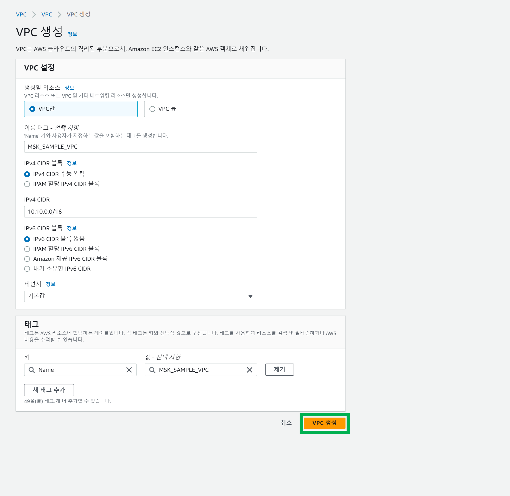

서브넷 1, 이름을 broker1 로 지정

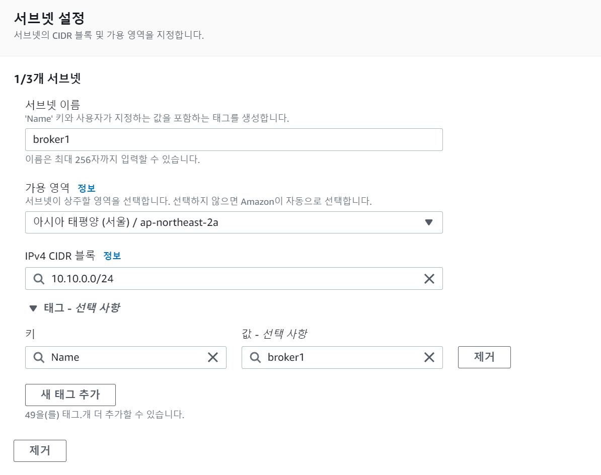

서브넷 2, 이름을 broker2 로 지정

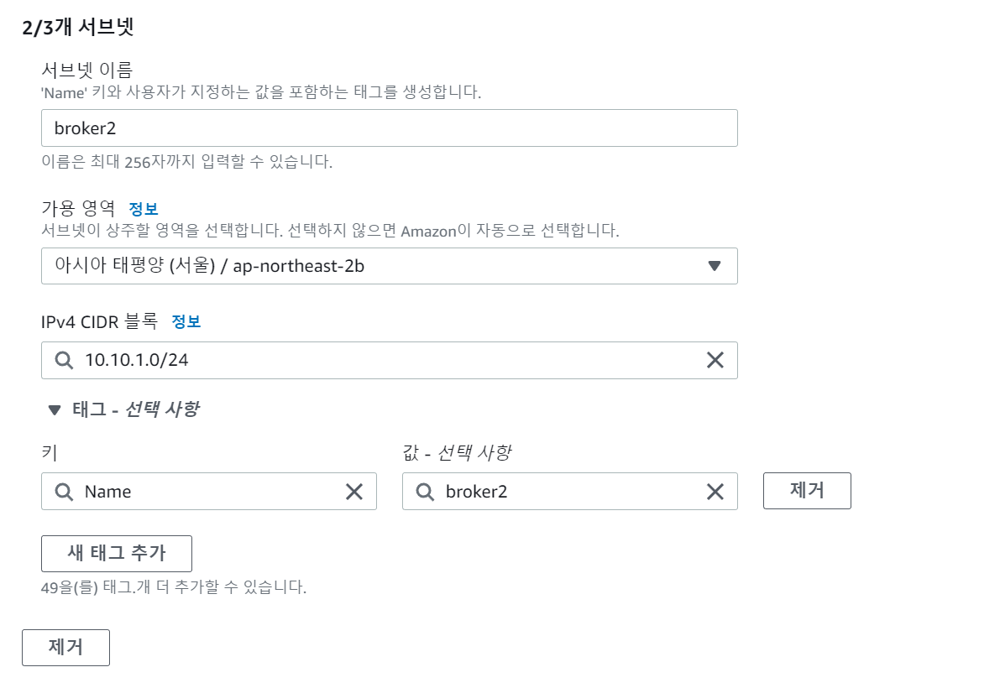

서브넷 3, 이름을 broker3 로 지정

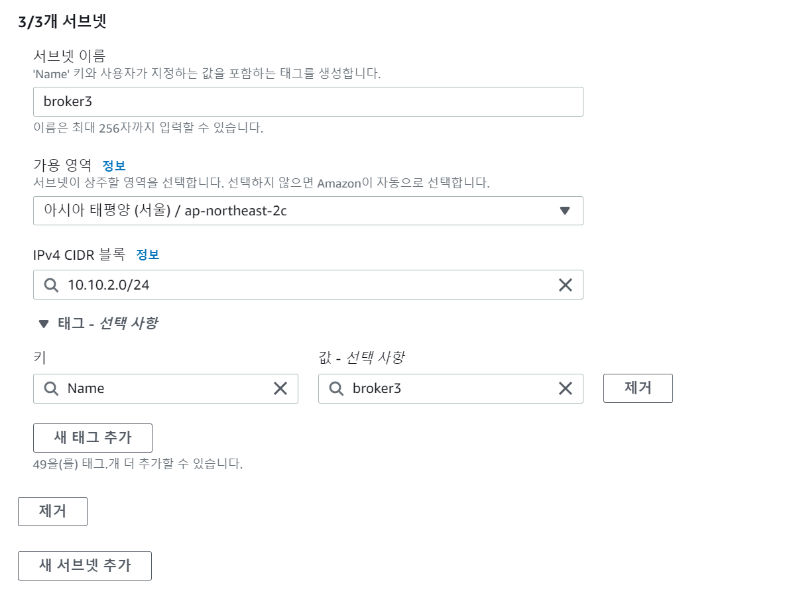

---

### 클러스터 생성

---

#### 단계 1. 클러스터 설정

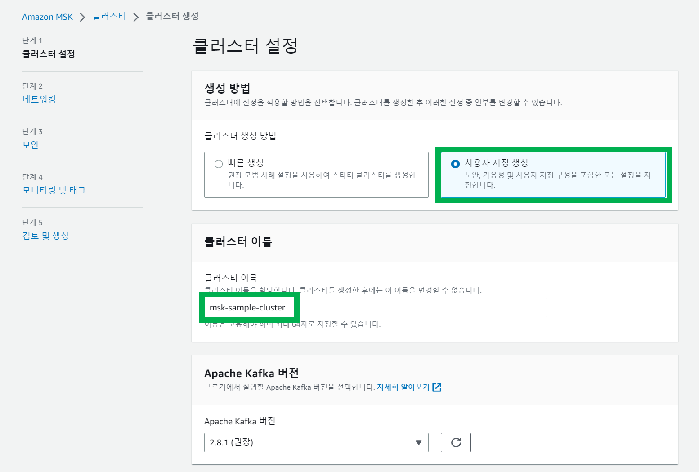

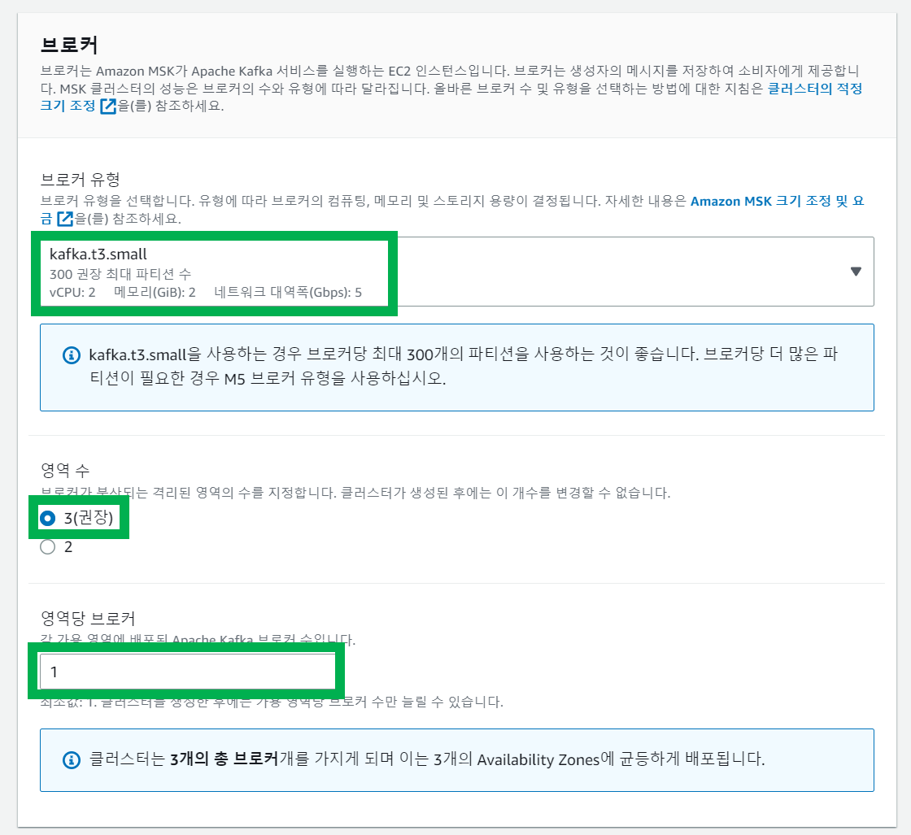

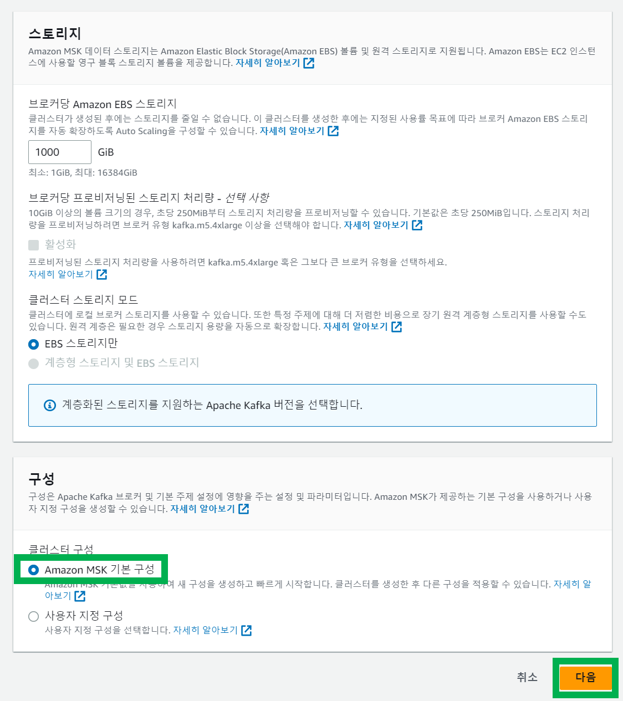

---

#### 단계 2. 네트워킹

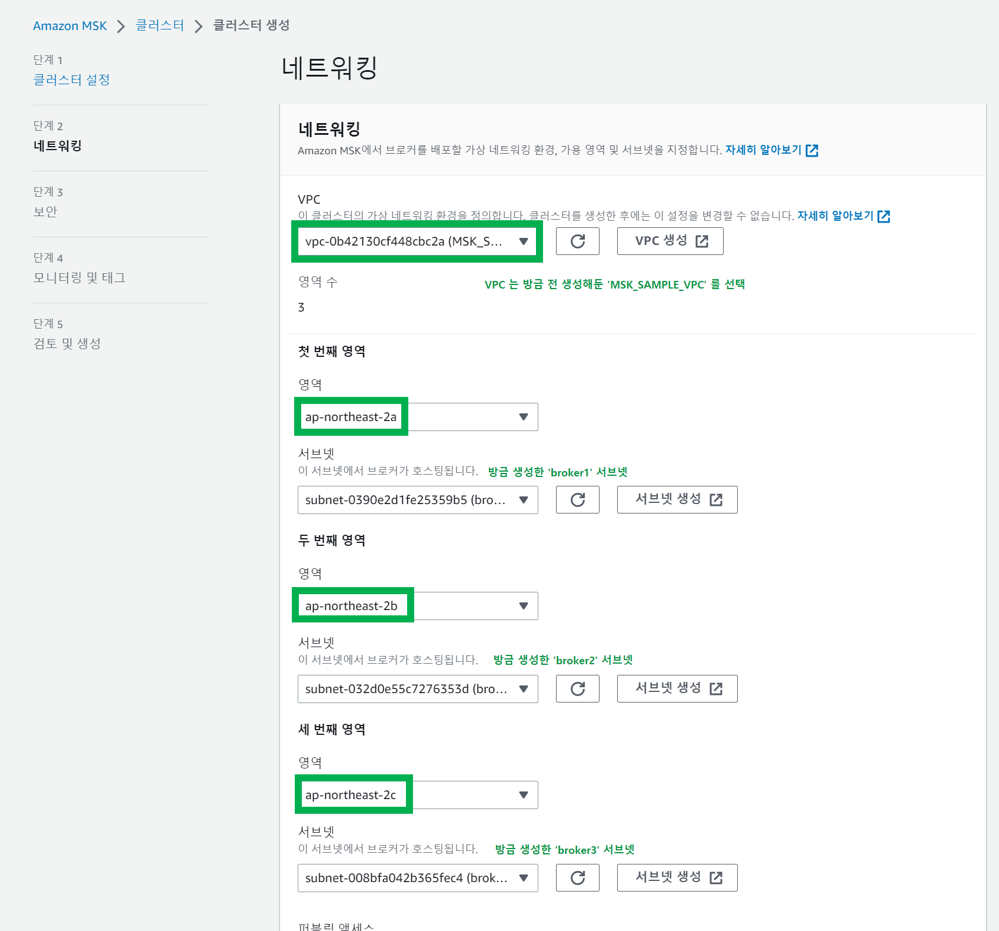

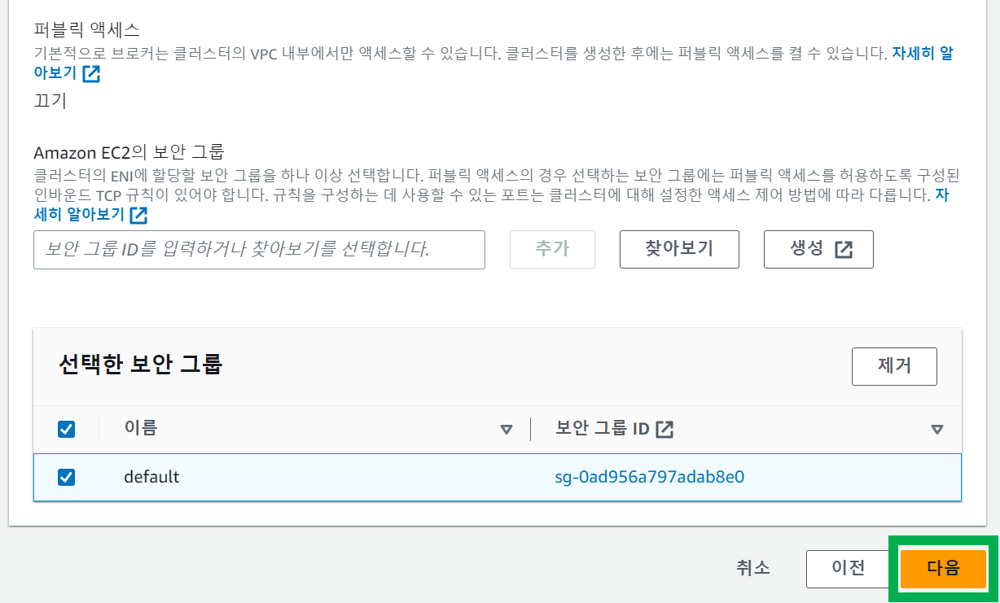

---

#### 단계 3. 보안

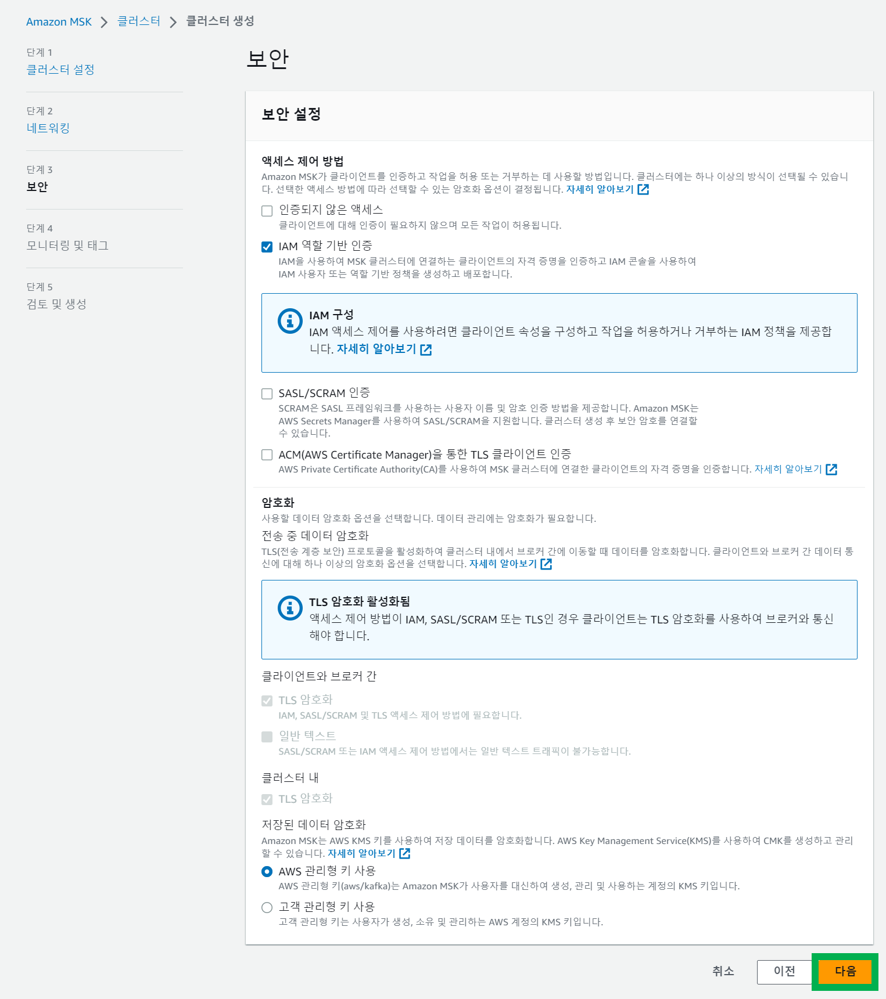

---

#### 단계 4. 모니터링 및 태그

프로메테우스 모니터링을 추가하고 싶다면 추가한다.

참고로 프로메테우스 모니터링을 추가하면 추가 비용이 발생한다.

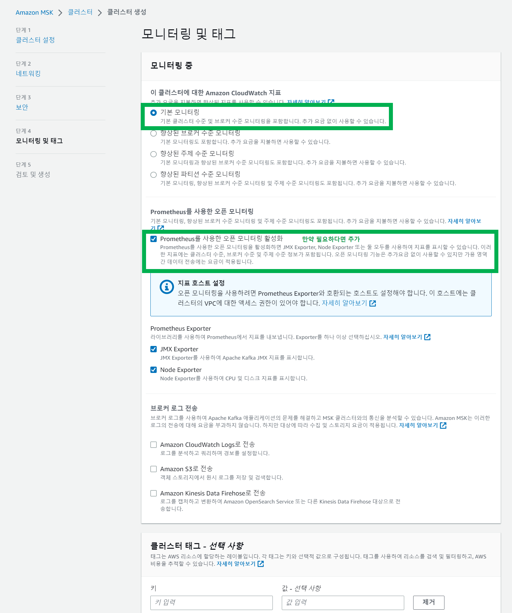

### 로그 화면

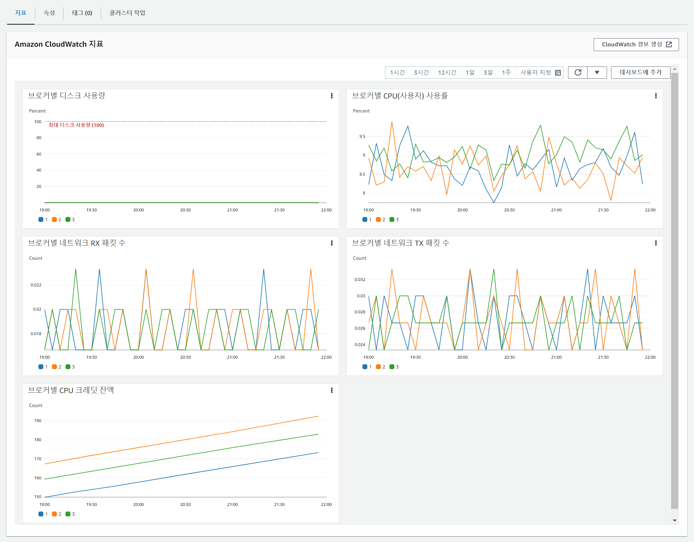

 

### 상세정보 화면

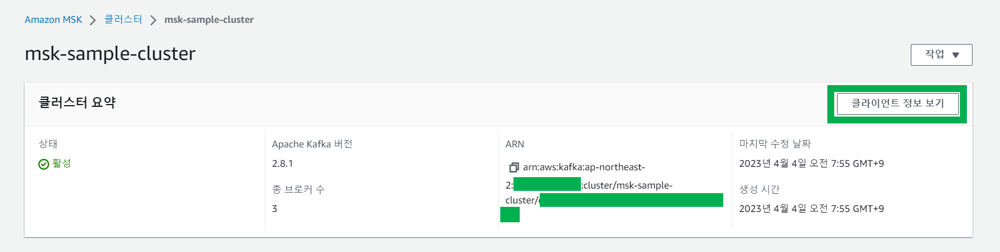

 

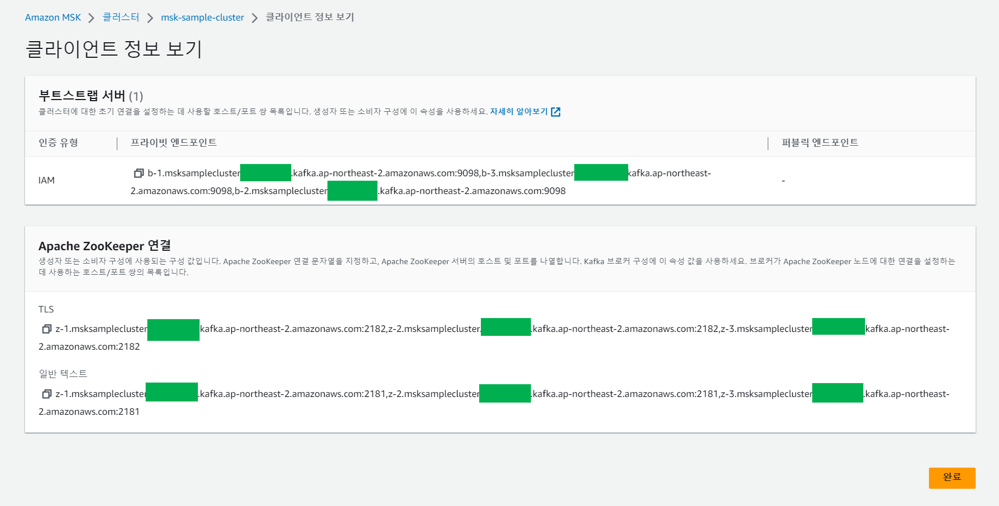

 
